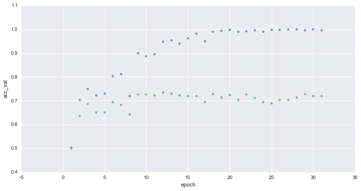
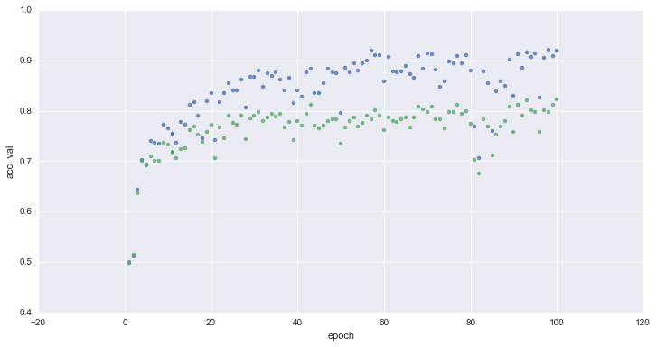
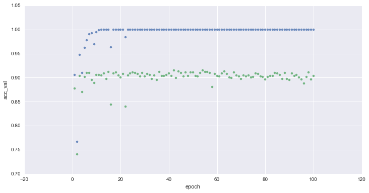

You can find the code and data for this notebook at: https://github.com/rajshah4/image_keras.  For a short background on Keras and R, please check out my [blog post](https://datascienceplus.com/deep-learning-with-r/).

The work here is based on the [Keras tutorial](https://blog.keras.io/building-powerful-image-classification-models-using-very-little-data.html) by Francois Chollet @fchollet  and the [workbook by Guillaume Dominici](https://github.com/gggdominici/keras-workshop).

## Introduction

This tutorial presents several ways to build an image classifier using keras from just a few hundred or thousand pictures for each class.

We will go over the following options:  

- training a small network from scratch (as a baseline)  
- using the bottleneck features of a pre-trained network  
- fine-tuning the top layers of a pre-trained network  
  
This will lead us to cover the following Keras features:   
  
- fit_generator for training Keras a model using data generators  
- ImageDataGenerator for real-time data augmentation  
- layer freezing and model fine-tuning  
- ...and more.  

## Data

The github repo includes about 3000 images for this model. The original Kaggle dataset is much larger. The purpose of this demo is to show how you can build models with smaller size datasets. You can improve this model by using more data, which is available at: 
https://www.kaggle.com/c/dogs-vs-cats/data  

The recommended folder structure is:  
```python
data/
    train/
        dogs/ ### 1024 pictures
            dog001.jpg
            dog002.jpg
            ...
        cats/ ### 1024 pictures
            cat001.jpg
            cat002.jpg
            ...
    validation/
        dogs/ ### 416 pictures
            dog001.jpg
            dog002.jpg
            ...
        cats/ ### 416 pictures
            cat001.jpg
            cat002.jpg
            ...
```

### Loading Tensorflow and Keras
Commands for installing keras and tensorflow are included but commented out.
Keras from CRAN can now also install tensorflow.
```{r}
library(keras)
#install_keras()
#install_keras(tensorflow = "gpu")
is_keras_available()
```


### File locations and settings
```{r}
train_directory <- "data/train"
validation_directory <- "data/validation"

img_width <- 150
img_height <- 150
batch_size <- 32
epochs <- 30
train_samples = 2048
validation_samples = 832
```

### Loading images
```{r}
train_generator <- flow_images_from_directory(train_directory, generator = image_data_generator(rescale=1. / 255),  
  target_size = c(img_height, img_width), color_mode = "rgb",
  class_mode = "binary", batch_size = batch_size, shuffle = TRUE,
  seed = 123)

validation_generator <- flow_images_from_directory(validation_directory, generator = image_data_generator(rescale=1. / 255),
  target_size = c(img_width, img_height), color_mode = "rgb", classes = NULL,
  class_mode = "binary", batch_size = batch_size, shuffle = TRUE,
  seed = 123)
```

## Small Conv Net

### Model architecture definition

```{r}
model <- keras_model_sequential()

model %>%
  layer_conv_2d(filter = 32, kernel_size = c(3,3), input_shape = c(img_height, img_width, 3)) %>%
  layer_activation("relu") %>%
  layer_max_pooling_2d(pool_size = c(2,2)) %>% 
  
  layer_conv_2d(filter = 32, kernel_size = c(3,3)) %>%
  layer_activation("relu") %>%
  layer_max_pooling_2d(pool_size = c(2,2)) %>%
  
  layer_conv_2d(filter = 64, kernel_size = c(3,3)) %>%
  layer_activation("relu") %>%
  layer_max_pooling_2d(pool_size = c(2,2)) %>%
  
  layer_flatten() %>%
  layer_dense(64) %>%
  layer_activation("relu") %>%
  layer_dropout(0.5) %>%
  layer_dense(1) %>%
  layer_activation("sigmoid")

model %>% compile(
  loss = "binary_crossentropy",
  optimizer = optimizer_rmsprop(lr = 0.0001, decay = 1e-6),
  metrics = "accuracy"
)
```

### Training
Takes a few seconds an epoch on GPU and 60s an epoch on CPU
```{r}
model %>% fit_generator(
  train_generator,
  steps_per_epoch = as.integer(train_samples/batch_size), 
  epochs = epochs, 
  validation_data = validation_generator,
  validation_steps = as.integer(validation_samples/batch_size)
  #,verbose=2  #Needed when using restudio server
  )
```


```{r}
save_model_weights_hdf5(model, 'models/basic_cnn_30_epochsR.h5', overwrite = TRUE)
```

If your model successfully runs at one epoch, go back and it for 30 epochs by changing nb_epoch above.  I was able to get to an val_acc of 0.71 at 30 epochs. 

### Evaluating on validation set
Computing loss and accuracy :
```{r}
evaluate_generator(model,validation_generator, validation_samples)
```
Evolution of accuracy on training (blue) and validation (green) sets for 1 to 32 epochs :


**After ~10 epochs the neural network reach ~70% accuracy. We can witness overfitting, no progress is made over validation set in the next epochs**

## Data augmentation for improving the model

By applying random transformation to our train set, we artificially enhance our dataset with new unseen images.  
This will hopefully reduce overfitting and allows better generalization capability for our network.

Example of data augmentation applied to a picture:


```{r}
# Defining the model ------------------------------------------------------
#img_width <- 150
#img_height <- 150

model <- keras_model_sequential()

model %>%
  layer_conv_2d(filter = 32, kernel_size = c(3,3), input_shape = c(img_height, img_width, 3)) %>%
  layer_activation("relu") %>%
  layer_max_pooling_2d(pool_size = c(2,2)) %>% 
  
  layer_conv_2d(filter = 32, kernel_size = c(3,3)) %>%
  layer_activation("relu") %>%
  layer_max_pooling_2d(pool_size = c(2,2)) %>%
  
  layer_conv_2d(filter = 64, kernel_size = c(3,3)) %>%
  layer_activation("relu") %>%
  layer_max_pooling_2d(pool_size = c(2,2)) %>%
  
  layer_flatten() %>%
  layer_dense(64) %>%
  layer_activation("relu") %>%
  layer_dropout(0.5) %>%
  layer_dense(1) %>%
  layer_activation("sigmoid")

model %>% compile(
  loss = "binary_crossentropy",
  optimizer = optimizer_rmsprop(lr = 0.001, decay = 1e-6),
  metrics = "accuracy"
)
```

```{r}

augment <- image_data_generator(rescale=1./255,
                               shear_range=0.2,
                               zoom_range=0.2,
                               horizontal_flip=TRUE)

train_generator_augmented <- flow_images_from_directory(train_directory, generator = augment,
  target_size = c(img_height, img_width), color_mode = "rgb",
  class_mode = "binary", batch_size = batch_size, shuffle = TRUE,
  seed = 123)

validation_generator <- flow_images_from_directory(validation_directory, generator = image_data_generator(rescale=1./255),
  target_size = c(img_height, img_width), color_mode = "rgb", classes = NULL,
  class_mode = "binary", batch_size = batch_size, shuffle = TRUE,
  seed = 123)

```

```{r}
model %>% fit_generator(
  train_generator_augmented,
  steps_per_epoch = as.integer(train_samples/batch_size), 
  epochs = epochs, 
  validation_data = validation_generator,
  validation_steps = as.integer(validation_samples/batch_size)
  #,verbose=2  #Needed when using restudio server
  )
```

```{r}
save_model_hdf5(model, 'models/augmented_30_epochsR.h5', overwrite = TRUE)
```

### Evaluating on validation set
Computing loss and accuracy :
```{r}
evaluate_generator(model,validation_generator, validation_samples)
```
Evolution of accuracy on training (blue) and validation (green) sets for 1 to 100 epochs :

**Thanks to data-augmentation, the accuracy on the validation set improved to ~80%**

## Using a pre-trained model

The process of training a convolutionnal neural network can be very time-consuming and require a lot of data.  

We can go beyond the previous models in terms of performance and efficiency by using a general-purpose, pre-trained image classifier.  This example uses VGG16, a model trained on the ImageNet dataset - which contains millions of images classified in 1000 categories. 

On top of it, we add a small multi-layer perceptron and we train it on our dataset.

### VGG16 + small MLP


#### VGG16 model is available in Keras
```{r}
model_vgg <- application_vgg16(include_top = FALSE, weights = "imagenet")
```

### Using the VGG16 model to process samples
```{r}

train_generator_bottleneck <- flow_images_from_directory(
        train_directory,
        target_size= c(img_height, img_width),
        batch_size=batch_size,
        class_mode=NULL,
        shuffle=FALSE)

validation_generator_bottleneck <- flow_images_from_directory(
        validation_directory,
        target_size= c(img_height, img_width),
        batch_size=batch_size,
        class_mode=NULL,
        shuffle=FALSE)
```
This is a long process, so we save the output of the VGG16 once and for all.  
```{r}
bottleneck_features_train <- predict_generator(model_vgg,train_generator_bottleneck, train_samples / batch_size)
saveRDS(bottleneck_features_train, "models/bottleneck_features_train.rds")
bottleneck_features_validation <- predict_generator(model_vgg,validation_generator_bottleneck, validation_samples / batch_size)
saveRDS(bottleneck_features_validation, "models/bottleneck_features_validation.rds")
```
Now we can load it...
```{r}
bottleneck_features_train <- readRDS("models/bottleneck_features_train.rds")
bottleneck_features_validation <- readRDS("models/bottleneck_features_validation.rds")
train_labels = c(rep(0,train_samples/2),rep(1,train_samples/2))
validation_labels = c(rep(0,validation_samples/2),rep(1,validation_samples/2))
```
And define and train the custom fully connected neural network :
```{r}
model_top <- keras_model_sequential()

model_top %>%
  layer_dense(units=nrow(bottleneck_features_train),input_shape = dim(bottleneck_features_train)[2:4]) %>% 
  layer_flatten() %>%
  layer_dense(256) %>%
  layer_activation("relu") %>%
  layer_dropout(0.5) %>%
  layer_dense(1) %>%
  layer_activation("sigmoid")

model_top %>% compile(
  loss = "binary_crossentropy",
  optimizer = optimizer_rmsprop(lr = 0.0001, decay = 1e-6),
  metrics = "accuracy")
```


```{r}
valid = list(bottleneck_features_validation, validation_labels)
model_top %>% fit(
        x = bottleneck_features_train, y = train_labels,
        epochs=epochs, 
        batch_size=16,  ##Hit out of memory with a batch size of 32
        validation_data=valid
        #,verbose=2  #Needed when using restudio server
        )

```

The training process of this small neural network is very fast : ~2s per epoch

```{r}
save_model_weights_hdf5(model_top, 'models/bottleneck_30_epochsR.h5', overwrite = TRUE)
```


### Bottleneck model evaluation
Loss and accuracy :
```{r}
evaluate(model_top,bottleneck_features_validation, validation_labels)
```
Evolution of accuracy on training (blue) and validation (green) sets for 1 to 32 epochs :

**We reached over 90% accuracy on the validation after ~1m of training (~20 epochs) and 8% of the samples originally available on the Kaggle competition !**

## Fine-tuning the top layers of a a pre-trained network
Start by instantiating the VGG base and loading its weights.

```{r}
model_vgg <- application_vgg16(include_top = FALSE, weights = "imagenet",
                               input_shape = c(as.integer(img_height), as.integer(img_width), as.integer(3))
                               )
```
Build a classifier model to put on top of the convolutional model. For the fine tuning, we start with a fully trained-classifer. We will use the weights from the earlier model. And then we will add this model on top of the convolutional base.

```{r}
top_model <- keras_model_sequential()

top_model %>%
  layer_dense(units=nrow(bottleneck_features_train),input_shape = model_vgg$output_shape[2:4]) %>% 
  layer_flatten() %>%
  layer_dense(256) %>%
  layer_activation("relu") %>%
  layer_dropout(0.5) %>%
  layer_dense(1) %>%
  layer_activation("sigmoid")

load_model_weights_hdf5(top_model, "models/bottleneck_30_epochsR.h5")

model_ft <- keras_model(inputs = model_vgg$input, outputs = top_model(model_vgg$output))
```

For fine turning, we only want to train a few layers.  This line will set the first 16 layers to non-trainable.
```{r}
for (layer in model_ft$layers[1:16])
 layer$trainable <- FALSE
```

Compile the model with a SGD/momentum optimizer and a very slow learning rate.
```{r}
model_ft %>% compile(
  loss = "binary_crossentropy",
  optimizer = optimizer_sgd(lr=1e-3, momentum=0.9),
  metrics = "accuracy")
```

```{r}

augment <- image_data_generator(rescale=1./255,
                               shear_range=0.2,
                               zoom_range=0.2,
                               horizontal_flip=TRUE)

train_generator_augmented <- flow_images_from_directory(train_directory, generator = augment,
  target_size = c(img_height, img_width), color_mode = "rgb",
  class_mode = "binary", batch_size = batch_size, shuffle = TRUE,
  seed = 123)

validation_generator <- flow_images_from_directory(validation_directory, generator = image_data_generator(rescale=1./255),
  target_size = c(img_height, img_width), color_mode = "rgb", classes = NULL,
  class_mode = "binary", batch_size = batch_size, shuffle = TRUE,
  seed = 123)

```

Fine-tune the model
```{r}
model_ft %>% fit_generator(
  train_generator_augmented,
  steps_per_epoch = as.integer(train_samples/batch_size), 
  epochs = epochs, 
  validation_data = validation_generator,
  validation_steps = as.integer(validation_samples/batch_size)
  #,verbose=2  #Needed when using restudio server
  )
```


```{r}
save_model_weights_hdf5(model_ft, 'finetuning_30epochs_vggR.h5', overwrite = TRUE)
load_model_weights_hdf5(model_ft, 'finetuning_30epochs_vggR.h5')
```
### Evaluating on validation set
Computing loss and accuracy :

```{r}
evaluate_generator(model_ft,validation_generator, validation_samples)
```

**We reached over 93% accuracy on the validation using 8% of the samples originally available on the Kaggle competition !**
